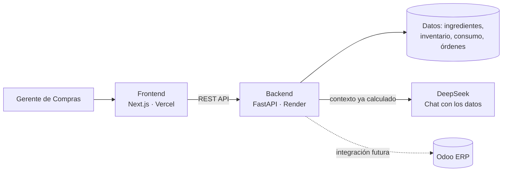

# Inventory Intelligence

**Sistema de alertas inteligentes de compras para cadenas de restaurantes — caso de uso: Barrio Pizza.**

Proyecta el consumo semanal de insumos por sucursal, detecta cuándo una orden de compra se aleja de lo que realmente hace falta, y propone la corrección lista para reenviar a cada proveedor — sin que nadie tenga que revisar tabla por tabla.

Este repositorio no tiene código: es el punto de entrada al proyecto completo. El código vive en los dos repos de abajo.

---

## Demo en vivo

| | Link |
|---|---|
| 🖥️ Dashboard | `[PENDIENTE: URL de Vercel]` |
| ⚙️ API (docs interactivas) | `[PENDIENTE: URL de Render]/docs` |
| 🎥 Video (3-5 min) | `[PENDIENTE: link de YouTube/Loom]` |

*(Probá los links en una ventana de incógnito antes de compartirlos — la primera carga del backend puede tardar unos segundos si estaba inactivo.)*

---

## El problema

Barrio Pizza tiene 10 sucursales que arman su propia orden de compra semanal a ojo. Piden de más (plata inmovilizada, insumos que se vencen) o de menos (quiebres de stock en pleno servicio), y revisar cada orden a mano le consume tiempo a la gerente de compras y es propenso a errores.

## Qué hace el sistema

- **Proyecta** el consumo de la próxima semana por sucursal e insumo, usando 6 semanas de histórico — con detección de tendencia y de semanas atípicas (outliers), no un promedio simple
- **Compara** la orden real contra la necesidad proyectada y genera alertas accionables: riesgo de quiebre, sobre-pedido, insumos olvidados
- **Corrige** la orden automáticamente, redondeada a formatos completos de compra, y la agrupa por proveedor lista para reenviar
- **Responde preguntas en español** sobre los datos de la semana vía chat (DeepSeek), sin inventar cifras — el modelo solo interpreta lo que el backend ya calculó

---

## Arquitectura

Backend y frontend son servicios independientes, cada uno con su propio repo y su propio deploy — el frontend nunca calcula nada, solo consume la API. El detalle de cómo se conectaría a un ERP como Odoo en producción está documentado en el README del backend.

---

## Repositorios

| Repo | Qué contiene |
|---|---|
| [`barrio-pizza-alertas`](https://github.com/ElMad6261/barrio-pizza-alertas) | Backend — FastAPI, proyección, motor de alertas, pedido corregido, chat |
| [`PENDIENTE: nombre real del repo frontend`](#) | Frontend — Next.js, TypeScript, dashboard |

---

## Capturas

`[PENDIENTE: screenshot de Alertas]`

`[PENDIENTE: screenshot de Proyecciones]`

`[PENDIENTE: screenshot de Órdenes Corregidas]`

`[PENDIENTE: GIF corto navegando el dashboard]`

---

## Stack técnico

**Backend:** FastAPI · pandas · scikit-learn · Pydantic · pytest · DeepSeek API (vía SDK de OpenAI)
**Frontend:** Next.js (App Router) · TypeScript · Tailwind · shadcn/ui
**Deploy:** Render (backend) · Vercel (frontend)

---

## Cómo se usó IA para resolverlo

`[PENDIENTE — tu reflexión sobre el proceso: qué partes armaste con ayuda de IA, qué decisiones fueron tuyas, qué aprendiste. Avisame cuando quieras armar un borrador juntos.]`
