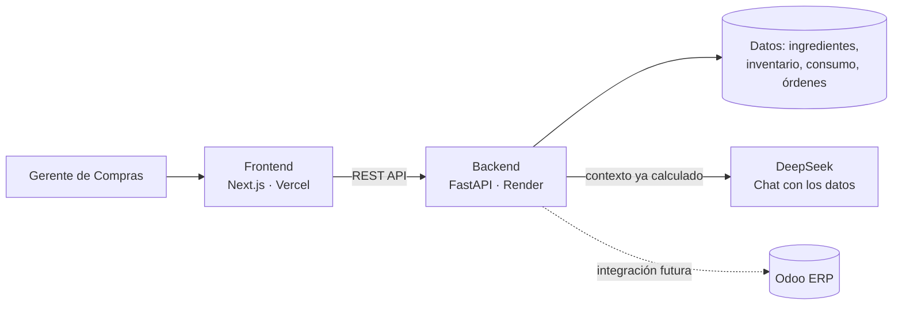

# Reto Barrio Pizza
**Sistema de alertas inteligentes de compras para cadenas de restaurantes — caso de uso: Barrio Pizza.**

Proyecta el consumo semanal de insumos por sucursal, detecta cuándo una orden de compra se aleja de lo que realmente hace falta, y propone la corrección lista para reenviar a cada proveedor — sin que nadie tenga que revisar tabla por tabla.

Este repositorio no tiene código: es el punto de entrada al proyecto completo. El código vive en los dos repos de abajo.

---

## Demo en vivo

| Servicio | Link |
|---|---|
| 🖥️ **Dashboard** | [Abrir Dashboard](https://barrio-pizza-dashboard.vercel.app/)              |
| ⚙️ **API (docs interactivas)** | [Abrir Swagger / API Docs](https://barrio-pizza-alertas.onrender.com/docs) |
| 🎥 Video (3-5 min) | `[PENDIENTE: link de YouTube/Loom]` |

---

## El problema

Barrio Pizza tiene 10 sucursales que arman su propia orden de compra semanal a ojo. Piden de más (plata inmovilizada, insumos que se vencen) o de menos (quiebres de stock en pleno servicio), y revisar cada orden a mano le consume tiempo a la gerente de compras y es propenso a errores.

## Qué hace el sistema

- **Proyecta** el consumo de la próxima semana por sucursal e insumo, usando 6 semanas de histórico — con detección de tendencia y de semanas atípicas (outliers), no un promedio simple
- **Compara** la orden real contra la necesidad proyectada y genera alertas accionables: riesgo de quiebre, sobre-pedido, insumos olvidados
- **Corrige** la orden automáticamente, redondeada a formatos completos de compra, y la agrupa por proveedor lista para reenviar
- **Responde preguntas en español** sobre los datos de la semana vía chat (DeepSeek), sin inventar cifras — el modelo solo interpreta lo que el backend ya calculó

---

## Arquitectura

Backend y frontend son servicios independientes, cada uno con su propio repo y su propio deploy — el frontend nunca calcula nada, solo consume la API. El detalle de cómo se conectaría a un ERP como Odoo en producción está documentado en el README del backend.

---

## Repositorios

| Repo | Qué contiene |
|---|---|
| [`barrio-pizza-alertas`](https://github.com/ElMad6261/barrio-pizza-alertas) | Backend — FastAPI, proyección, motor de alertas, pedido corregido, chat |
| [`barrio-pizza-dashboard`](https://github.com/ElMad6261/barrio-pizza-dashboard) | Frontend — Next.js, TypeScript, dashboard |

---

## Capturas

**Resumen**

**Alertas**

**Proyecciones**

.png>)

**Órdenes Corregidas**

**Agente de IA**

**Configuración**

**Soporte**

**Navegando el dashboard**

**Chat con los datos en acción**

---

## Stack técnico

**Backend:** FastAPI · pandas · scikit-learn · Pydantic · pytest · DeepSeek API (vía SDK de OpenAI)
**Frontend:** Next.js (App Router) · TypeScript · Tailwind · shadcn/ui
**Deploy:** Render (backend) · Vercel (frontend)

---

## Cómo se usó IA para resolverlo

`Antes de que llegara el reto ya tenía una idea armada de cómo encarar el proyecto. Para el frontend quería usar React/Next.js, apoyado en componentes de 21st.dev o shadcn/ui — los elegí porque son herramientas que se usan mucho en proyectos reales y son populares (las conocí viendo recomendaciones en Reddit y comunidades similares). Para el backend elegí FastAPI: es simple de usar, el proyecto no iba a ser demasiado extenso, y al ser una herramienta popular tuve menos fricción a la hora de hacer el deployment.

Con el stack ya definido, dividí el trabajo con IA según la parte del proyecto:

Gemini se encargó de todo lo relacionado al frontend: componentes en React/Next.js y la integración de shadcn/ui y 21st.dev.
Claude se encargó del backend completo (proyección, motor de alertas, pedido corregido, chat) y de la conexión entre backend y frontend — desde el diseño de los endpoints hasta el deployment. También le pedí ayuda para encontrar opciones de hosting gratuitas y confiables para este tipo de proyecto.

La elección de DeepSeek para el chat fue una decisión personal: ya tenía tokens cargados en mi cuenta y decidí aprovecharlos para el proyecto, además de que me daba la tranquilidad de una buena calidad de respuesta.`

## Miguel Arosemena
